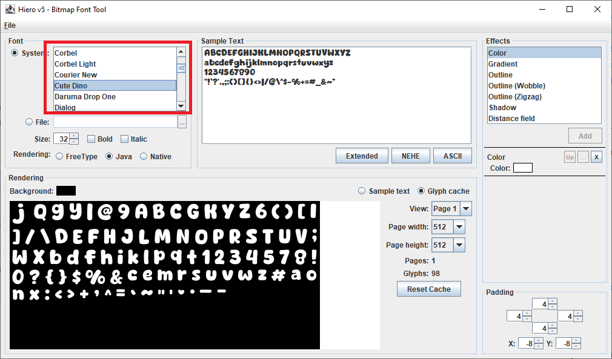
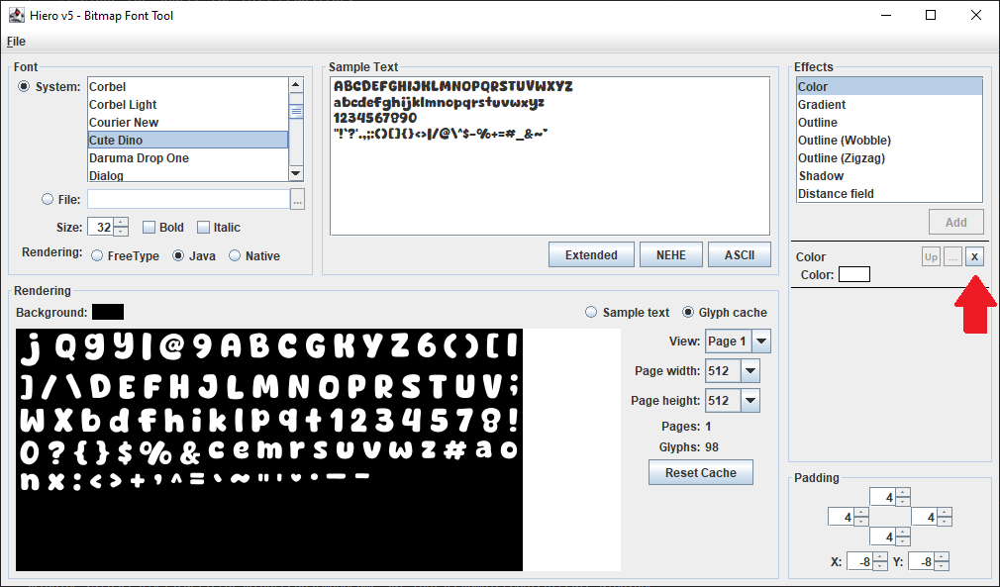
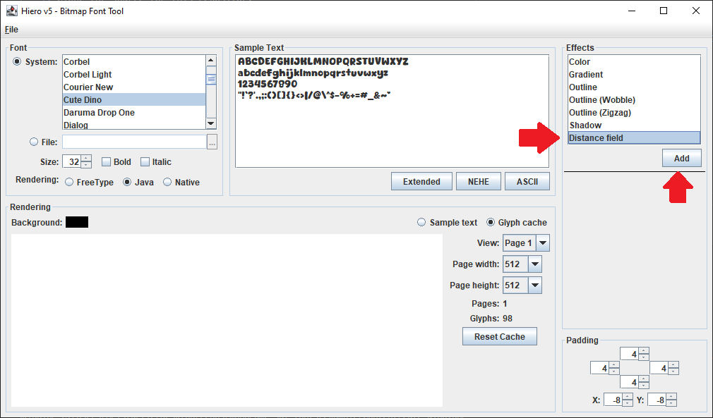
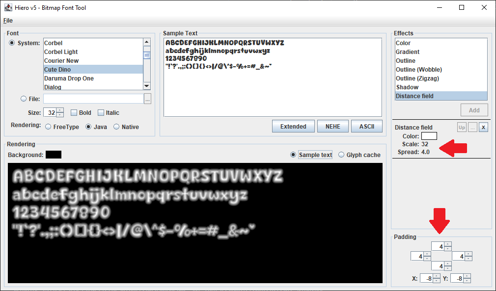
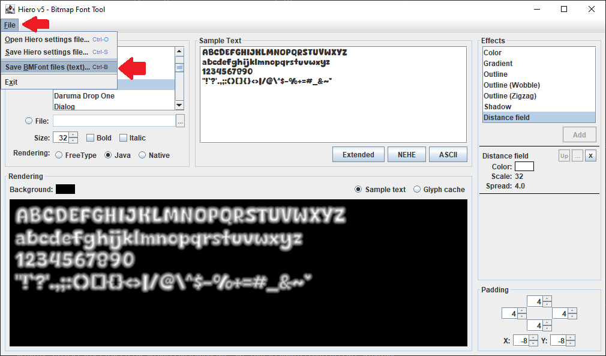

# MonoGame SDF Fonts
This is an example of rendering Signed Distance Field Fonts in MonoGame.

## How to use.
1. Clone the source for this repository
2. Add a reference to `/source/MonoGame.Sdf.Fonts/MonoGame.Sdf/Fonts.csproj` in your MonoGame project
3. Add the `/source/MonoGame.Sdf.Fonts/sdf-effect.fx` effect file to your project using the MGCB Editor.
4. Add the `.fnt` file and it's associated textures to your project using the MGCB Editor, but set their build action to **Copy** (even the texture).  See the section below for how to generate these files for use.

## How to Create a Distance Field Font
1. Download the [libGDX Hiero](https://libgdx.com/wiki/tools/hiero) application and run it.
2. In the application, select the font you would like to use

3. Click the **[x]** on the left to remove the **Color** effect that is set by default

4. Select the **Distance Field** effect then click the **Add** button

5. Set the **Spread**, **Padding**, **Spacing**, and **Scale**, values in the following order
   1. Set the **Spread** value so that it is about half the width of the thickest line in your font, in pixels.
   2. Set all four **Padding** values to the same value you set for **Spread**.
   3. Set both the X and Y **Spacing** values to *minus* twice the **Spread** value.
   4. Last, set the **Scale** value to your desired font size.

> [!TIP]
> We set the **Scale** value last because the larger the scale, the longer Hiero takes to render the preview.  By keeping it at 1 while adjusting the other settings, the setting the **Scale** last, you won't get as many UI freezes while it rasterizes the preview.

6. Click **File** then **Save BMFont files (text)** from the top menu and to export it.  This will export a `.fnt` file and the associated `.png` texture files that go with it.

## License
**MonoGame.Sdf.Fonts** is licensed under the **MIT License**. Please refer to the [LICENSE](./LICENSE) file for full license text.
